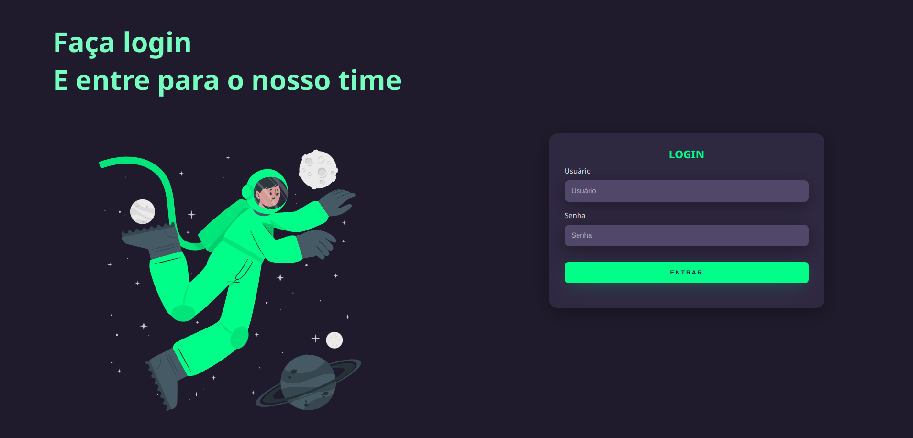
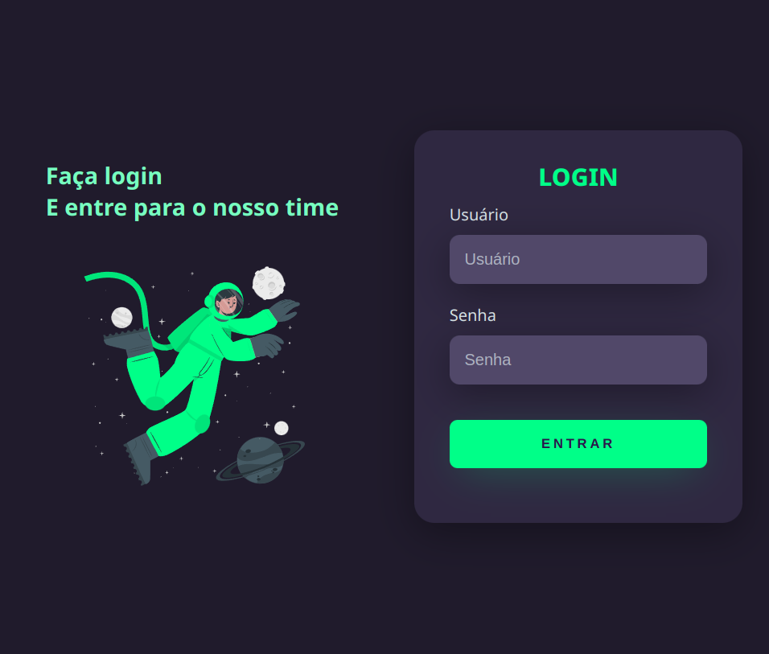
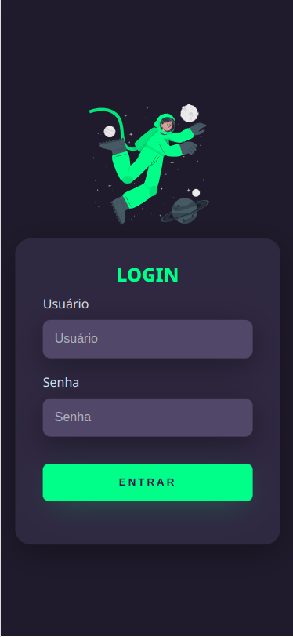

<h1 align="center">
  
  <span style= color:#77FFC0> Login Astronauta </span>
</h1>

<div align="center">
  <a href="#-projeto">Projeto</a>&nbsp;&nbsp;&nbsp;|&nbsp;&nbsp;&nbsp;
  <a href="#-tecnologias">Tecnologias</a>&nbsp;&nbsp;&nbsp;|&nbsp;&nbsp;&nbsp;
  <a href="#-licença">Licença</a>&nbsp;&nbsp;&nbsp;|&nbsp;&nbsp;&nbsp;
  <a href="#-autor">Autor</a>
</div>

<br>

<p align="center">
  
  
  
</p>

<br>

## 💻 Projeto

Este projeto consiste em um estudo para aprimorar meus conhecimentos em CSS3.
<br>

### Tela de Login Desktop

<p align="center">
    
</p>
<br>

### Tela de login em Tablet

<p align="center">
    
</p>
<br>

### Tela de Login em Smartphone

<p align="center">
    
</p>
<br>

## 🚀 Tecnologias

Esse projeto foi desenvolvido com as seguintes tecnologias e ferramentas:

<div align="center">
  
  
  
  
</div>

<br>

## 🔥 Executar Aplicação

### 🎇 Executando Localmente a Aplicação

Caso você deseja executar o projeto na sua máquina local, você precisará clonar o projeto, para isso, basta seguir os passos abaixo:

### 🌀 Começando...

Para começar, você deve simplesmente clonar o repositório do projeto na sua máquina.

Navegue até o local onde você clonou o projeto, exemplo:

```sh
C:\Users\NomeDoComputador\Documents\CloneDoProjeto
```

### 🛰️ Executando o projeto

Bom, agora que clonou o projeto **(dentro da pasta `login-astronauta` do projeto clonado)** execute o projeto clicando duas vezes no arquivo index.html:

Pronto! dessa forma o projeto `login-astronauta` estará rodando localmente em sua maquina.

<br>

## 🚩 Tenho Dúvidas... O que fazer?

Caso tenha dúvidas sobre o código do projeto, sintam-se a vontade em abrir uma **[ISSUE AQUI](https://github.com/Wanderson-A-Timoteo/login-astronauta/issues)**. Assim que possível, responderei todas as dúvidas!

<br>

## 💡 Licença

Esse projeto está sob a licença MIT. Veja o arquivo [LICENSE](.github/LICENSE.md) para mais detalhes.

<br>

## 🎆 Autor

Feito com ♥ by

[<br><sub>Wanderson A. Timóteo</sub>](https://www.wandersontimoteo.ga/)

<br>

## 🤝 Agradecimentos

<p align="center">
    
</p>
<br>

Projeto desenvolvido assistindo a vídeo aula no YouTube, canal do [Markzuel](https://www.youtube.com/watch?v=69-WfrVBli8).

Agradecimento ao [Markzuel](https://www.youtube.com/@Markzuel) por compartilhar conteúdo relevante e com qualidade de ensino.
